<div align="center">
  <h2>Metamorphix</h2>
  <h3>Webhook-Driven Task Processing Pipeline</h3>
</div>

<div align="center">
  
  
  
  
  
  
  
  
  
  
  
  
  
  
  
  
</div>


### Data Flow Example

1. User creates a Pipeline with a unique sourceUrl
2. External system sends a POST to POST /api/webhooks/{sourceUrl}
3. API validates the pipeline, creates a Job record, and queues it
4. Worker picks up the job:

- Executes the configured actionType (e.g. transform)
- For each subscriber, attempts delivery with retries
- Logs results in delivery_attempts

5. User can query job status and history via the API

## Setup

### Pre Requisites

- Docker
- Docker Compose plugin

### Installation

clone the repository

```bash
git clone https://github.com/Abezzi/metamorphix.git
cd metamorphix
```

start docker

```bash
systemctl start docker
```

run docker (in the project directory)

```bash
docker-compose up -d --build
```

this command builds 3 images, 1 network and 5 containers:

```bash
 ✔ Image metamorphix-api          Built                                                                                                                                                                                                                   1.2s
 ✔ Image metamorphix-worker       Built                                                                                                                                                                                                                   1.2s
 ✔ Image metamorphix-frontend     Built                                                                                                                                                                                                                  63.7s

 ✔ Network metamorphix_default    Created                                                                                                                                                                                                                 0.1s

 ✔ Container metamorphix-redis    Started                                                                                                                                                                                                                 3.5s
 ✔ Container metamorphix-postgres Started                                                                                                                                                                                                                 3.5s
 ✔ Container metamorphix-worker   Started                                                                                                                                                                                                                 3.6s
 ✔ Container metamorphix-api      Started                                                                                                                                                                                                                 3.6s
 ✔ Container metamorphix-frontend Started
```

you can check the logs of the servers running in the background by typing any of this commands in your terminal:

```bash
docker-compose logs api
docker-compose logs frontend
docker-compose logs worker
docker-compose logs redis
docker-compose logs postgres
```

you can also execute SQL commands directly into the postgres container by running:

```bash
docker compose exec postgres psql -U postgres -d metamorphix
```

> [!NOTE]
> If migrations don't work you probably deleted the migrations folder or the schema doesn't exist, so please recreate it and run docker compose again.

```bash
docker docker compose exec postgres psql -U postgres -d metamorphix
# now inside metamorphix postgres database inside the container
CREATE SCHEMA drizzle;

# now you can exit and run the docker-compose command again
docker-compose up -d --build
```

## API Documentation

The Metamorphix API is built with Express.js and follows a RESTful design. All protected routes require authentication via JWT (Bearer token).

**Base URL**: `http://localhost:3000/api`

### Authentication Routes (api/auth)

| Method | Endpoint  | Description                   | Auth Required |
| ------ | --------- | ----------------------------- | ------------- |
| POST   | /sign-up  | Register a new user           | No            |
| POST   | /sign-in  | Login and receive JWT         | No            |
| POST   | /sign-out | Logout (revoke current token) | Yes           |
| POST   | /refresh  | Refresh access token          | Yes           |
| POST   | /revoke   | Revoke a refresh token        | Yes           |
| PUT    | /profile  | Update user profile           | Yes           |

### Pipelines (api/pipelines)

| Method | Endpoint             | Description             | Auth Required |
| ------ | -------------------- | ----------------------- | ------------- |
| POST   | /                    | Create a new pipeline   | Yes           |
| GET    | /                    | List user's pipelines   | Yes           |
| GET    | /pipelines-statistic | get pipeline statistics | Yes           |
| GET    | /:id                 | Get pipeline by ID      | Yes           |
| PATCH  | /:id                 | Update pipeline         | Yes           |
| DELETE | /:id                 | Delete pipeline         | Yes           |

### Subscribers (api/subscribers)

| Method | Endpoint | Description             | Auth Required |
| ------ | -------- | ----------------------- | ------------- |
| POST   | /        | Create a new subscriber | Yes           |
| GET    | /        | List user's subscribers | Yes           |
| GET    | /:id     | Get subscriber by ID    | Yes           |
| PATCH  | /:id     | Update subscriber       | Yes           |
| DELETE | /:id     | Delete subscriber       | Yes           |

### Webhook (Public Ingestion)

| Method | Endpoint            | Description                                 | Auth Required |
| ------ | ------------------- | ------------------------------------------- | ------------- |
| POST   | /webhook/:sourceUrl | Ingest webhook -> queues job for processing | No            |

> [!NOTE]
> The :sourceUrl is the unique URL generated when creating a pipeline.

### Jobs (/api/jobs)

| Method | Endpoint | Description          | Auth Required |
| ------ | -------- | -------------------- | ------------- |
| GET    | /        | List user's jobs     | Yes           |
| GET    | /:id     | Get job detail by id | Yes           |

### Delivery Attempts (/api/delivery-attempts)

| Method | Endpoint | Description                | Auth Required |
| ------ | -------- | -------------------------- | ------------- |
| GET    | /        | List delivery attempts     | Yes           |
| GET    | /:id     | Get delivery attempt by id | Yes           |

### Healthcheck (for testing purpose)

| Method | Endpoint | Description | Auth Required |
| ------ | -------- | ----------- | ------------- |
| GET    | /ready   | Returns OK  | No            |

### Request/Response Examples

Create pipeline:

```json
POST /api/pipelines
{
  "name": "Lead Processing",
  "description": "Process new leads from Typeform",
  "actionType": "transform",
  "actionConfig": {
    "mapping": { "fullName": "name.first + ' ' + name.last" }
  },
  "subscribersIds": ["uuid1", "uuid2"]
}
```

trigger webhook:

```bash
curl -X POST http://localhost:3000/api/webhooks/your-unique-source-url \
  -H "Content-Type: application/json" \
  -d '{"event": "new_lead", "data": {...}}'
```

### Authentication

- Most endpoints require Authorization: Bearer <jwt-token>

## Architecture

Metamorphix is built as a modern, scalable webhook processing pipeline with a clean separation of concerns.

### High level overview

The system follows an event-driven, asynchronous architecture:

1. Inbound Webhook → Queue → Background Worker → Processing → Delivery to Subscribers

This design ensures the webhook ingestion is fast and non-blocking (returns 202 Accepted immediately), while heavy processing happens in the background.This design ensures the webhook ingestion is fast and non-blocking (returns 202 Accepted immediately), while heavy processing happens in the background.This design ensures the webhook ingestion is fast and non-blocking (returns 202 Accepted immediately), while heavy processing happens in the background.This design ensures the webhook ingestion is fast and non-blocking (returns 202 Accepted immediately), while heavy processing happens in the background.This design ensures the webhook ingestion is fast and non-blocking (returns 202 Accepted immediately), while heavy processing happens in the background.This design ensures the webhook ingestion is fast and non-blocking (returns 202 Accepted immediately), while heavy processing happens in the background.This design ensures the webhook ingestion is fast and non-blocking (returns 202 Accepted immediately), while heavy processing happens in the background.This design ensures the webhook ingestion is fast and non-blocking (returns 202 Accepted immediately), while heavy processing happens in the background.

### System Components

| Components        | Techonology                                            | Responsability                                             |
| ----------------- | ------------------------------------------------------ | ---------------------------------------------------------- |
| API Server        | Node.js + Express + TypeScript                         | Handles CRUD operations, authentication, webhook ingestion |
| Background Worker | Node.js + BullMQ (Redis)                               | Processes jobs asynchronously                              |
| Database          | PostgreSQL + Drizzle ORM                               | Persistent storage for pipelines, jobs, deliveries         |
| Cache/Queue       | Redis                                                  | Job queue + rate limiting + sessions                       |
| Frontend          | React + Vite + TypeScript + TailwindCSS + ReduxToolkit | User interface for managing pipelines & monitoring         |
| Containerization  | Docker with Docker Compose plugin                      | Reproducible local & production setup                      |

### Project Structure

```bash
backend/
├── src/
│   ├── db/                  # Database layer
│   │   ├── schema.ts        # Drizzle schema (users, pipelines, jobs, etc.)
│   │   ├── migrations/      # Auto-generated migrations
│   │   └── queries/         # Reusable database queries
│   ├── routes/              # Route definitions
│   │   ├── handlers/        # Business logic per feature
│   │   └── *.ts             # Route registration
│   ├── middlewares/         # Auth, validation, error handling
│   ├── utils/               # Helpers (processors, retry logic, etc.)
│   ├── worker.ts            # Background job processor
│   ├── index.ts             # Express app entry point
│   └── config.ts            # Environment configuration
├── Dockerfile
└── drizzle.config.ts
```

```bash
frontend/
├── public                        # Static resource
│   ├── img                       # Images
│   ├── data                      # Static data
│   └── ...                       # Other static files
├── src
│   ├── @types                    # type files that share across the temeplate
│   │   ├── ...
│   ├── assets                    # App static resource
│   │   ├── maps                  # Map meta data
│   │   ├── markdown              # Markdown files
│   │   ├── styles                # Global CSS files
│   │   └── svg	                  # SVG files
│   ├── components                # General components
│   │   ├── docs                  # Documentations related components
│   │   ├── layout                # Layout components
│   │   ├── route                 # Components related to route
│   │   ├── shared                # Upper level components built on top of ui components
│   │   ├── template              # Template components, such as Header, Footer, Nav, etc...
│   │   └── ui                    # Bottom level components, such as Button, Dropdown, etc...
│   ├── configs                   # Configuration files
│   │   ├── navigation.config     # Sidebar Navigation
│   │   └── routes.config         # Routes where you link path and views
│   ├── constants                 # Constant files
│   │   └── ...
│   ├── locales                   # Localization configuration
│   │   ├── lang
│   │   │   └── ...               # Language JSON files
│   │   └── index.ts              # Localization entry file
│   ├── services                  # Service files for managing API integrations
│   │   ├── ApiService.ts         # Api request & response handler
│   │   ├── BaseService.ts        # Axios configs & interceptors
│   │   ├── JobService.ts         # Job related API request
│   │   ├── SubscriberService.ts        # Subscriber related API request
│   │   ├── DeliveryAttemptService.ts        # Delivery Attempts related API request
│   │   └── PipelineService.ts                   # Pipeline related API request
│   ├── store                     # Main Redux store
│   │   ├── slices                # Genaral slices
│   │   │   └── ...
│   │   ├── hook.ts               # Store hook file
│   │   ├── index.ts              # Store entry file
│   │   └── rootReducer.ts        # Root reducer
│   │   └── storeSetup.ts         # Overall store setup
│   ├── utils                     # All reusable function & hooks
│   │   ├── hooks                 # Hooks
│   │   │   └── ...
│   │   └── ...                   # Reusable functions
│   ├── views                     # View files that render all the pages
│   │   ├── ...                   # All view files
│   │   └── index.ts              # View entry point
│   │   App.tsx                   # App setup
│   │   index.css                 # Css entry
│   │   main.tsx                  # React entry
│   │   mdDynamicImporter.tsx     # Dynamic md file import handling
│   └── vite-env.d.ts             # Vite environment declaration
├── .twSafelistGenerator          # Tailwind middleware for safe list
├── .eslintignore                 # Ignore file for eslint
├── .eslintrc.cjs                 # eslint config
├── .gitignore                    # Ignore file for git
├── .prettierignore               # Ignore file for prettier
├── .prettierrc                   # Prettier config
├── index.html                    # Entry file for the web
├── package.json
├── package.lock.json
├── postcss.config.cjs            # PostCss configuration file
├── README.md
├── safelist.txt                  # A generated whitelist classes for Tailwind css
├── tailwind.config.cjs           # TailwindCSS configuration file
├── tsconfig.eslint.json          # Typescript config for eslint
├── tsconfig.json                 # Project Typescript configuration file
├── tsconfig.eslint.json          # Typescript config for node
└── vite.config.ts                # Config file for vite
```

### Design Decisions

- Separation of Concerns: API layer is thin. All business logic lives in handlers/ and reusable processors.
- Asynchronous Processing: Webhooks never block. Jobs are queued and processed by dedicated workers.
- Reliability:
  - Exponential backoff retries on delivery failures
  - Detailed logging of every delivery attempt
  - Job status tracking (queued → processing → completed | failed)
- Extensibility: Easy to add new actionType processors (transform, filter, enrich, etc.) via a registry pattern.
- Security: JWT authentication, API keys, input validation, and proper error handling.
- Observability: Health checks, job history, and delivery logs.

### Mermaid Architecture Diagram


